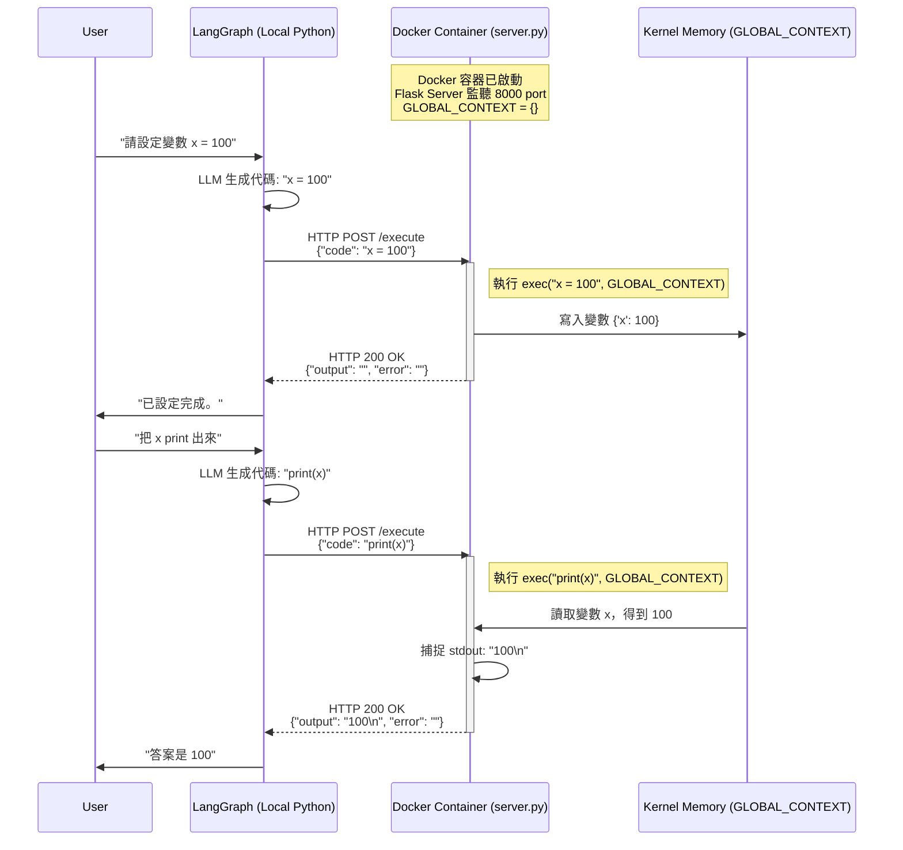
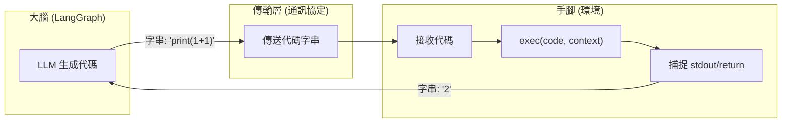

# Code 執行流程說明

```mermaid
sequenceDiagram
    participant User
    participant LangGraph (Local Python)
    participant Docker Container (server.py)
    participant Kernel Memory (GLOBAL_CONTEXT)

    Note over Docker Container (server.py): Docker 容器已啟動<br/>Flask Server 監聽 8000 port<br/>GLOBAL_CONTEXT = {}

    %% --- 第一輪對話 ---
    User->>LangGraph (Local Python): "請設定變數 x = 100"
    LangGraph (Local Python)->>LangGraph (Local Python): LLM 生成代碼: "x = 100"
    LangGraph (Local Python)->>Docker Container (server.py): HTTP POST /execute<br/>{"code": "x = 100"}
    
    activate Docker Container (server.py)
    Note right of Docker Container (server.py): 執行 exec("x = 100", GLOBAL_CONTEXT)
    Docker Container (server.py)->>Kernel Memory (GLOBAL_CONTEXT): 寫入變數 {'x': 100}
    Docker Container (server.py)-->>LangGraph (Local Python): HTTP 200 OK<br/>{"output": "", "error": ""}
    deactivate Docker Container (server.py)
    
    LangGraph (Local Python)->>User: "已設定完成。"

    %% --- 第二輪對話 (展示持久化) ---
    User->>LangGraph (Local Python): "把 x print 出來"
    LangGraph (Local Python)->>LangGraph (Local Python): LLM 生成代碼: "print(x)"
    LangGraph (Local Python)->>Docker Container (server.py): HTTP POST /execute<br/>{"code": "print(x)"}

    activate Docker Container (server.py)
    Note right of Docker Container (server.py): 執行 exec("print(x)", GLOBAL_CONTEXT)
    Kernel Memory (GLOBAL_CONTEXT)->>Docker Container (server.py): 讀取變數 x，得到 100
    Docker Container (server.py)->>Docker Container (server.py): 捕捉 stdout: "100\n"
    Docker Container (server.py)-->>LangGraph (Local Python): HTTP 200 OK<br/>{"output": "100\n", "error": ""}
    deactivate Docker Container (server.py)

    LangGraph (Local Python)->>User: "答案是 100"
```

```mermaid
graph LR
    subgraph Brain ["大腦 (LangGraph)"]
        A[LLM 生成代碼]
    end
    
    subgraph Transport ["傳輸層 (通訊協定)"]
        B[傳送代碼字串]
    end
    
    subgraph Execution ["手腳 (環境)"]
        C["接收代碼"] --> D["exec(code, context)"]
        D --> E["捕捉 stdout/return"]
    end
    
    A -->|"字串: 'print(1+1)'"| B
    B --> C
    E -->|"字串: '2'"| A
```